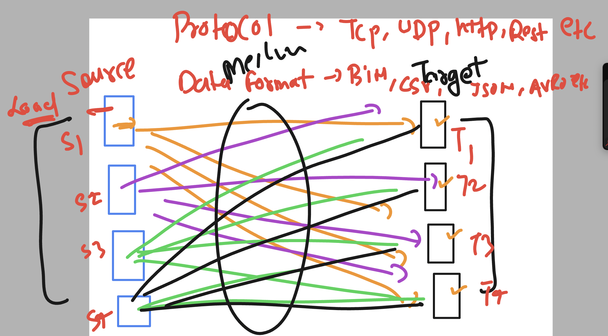
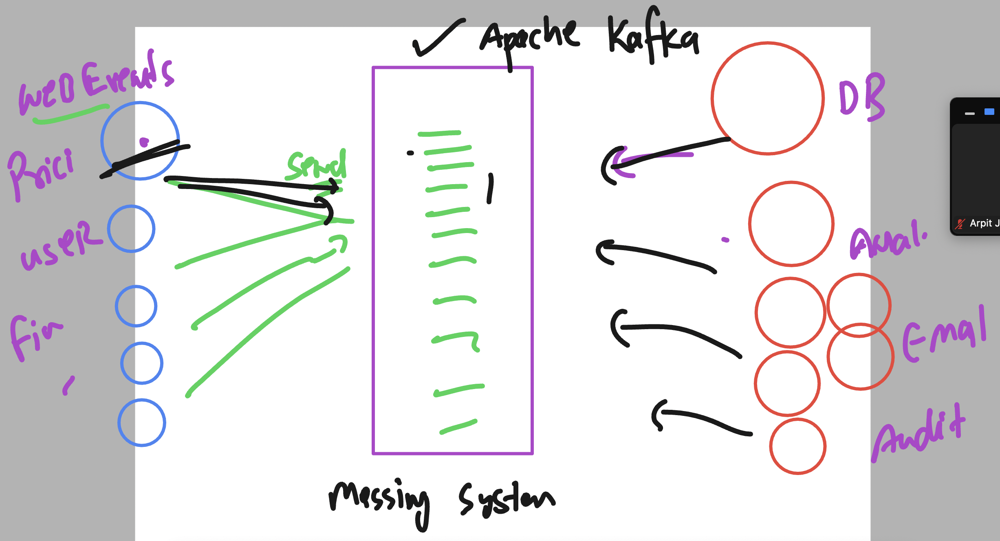
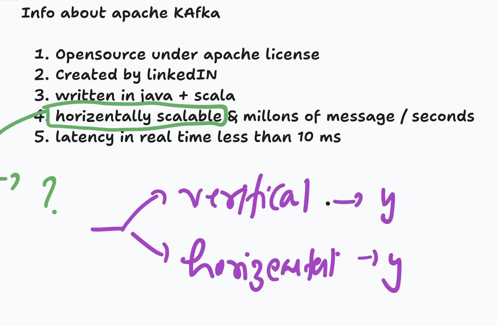
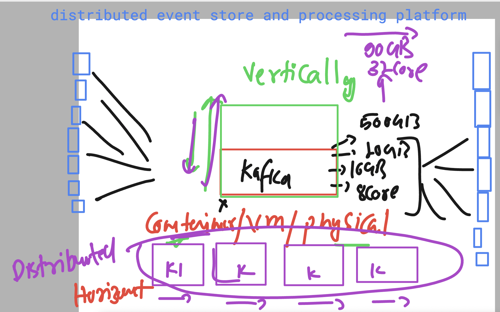
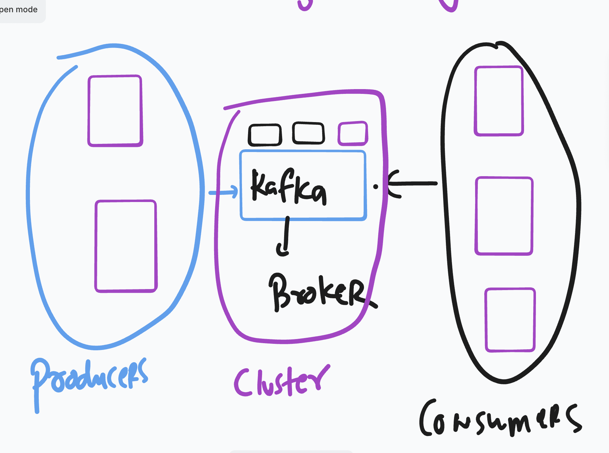
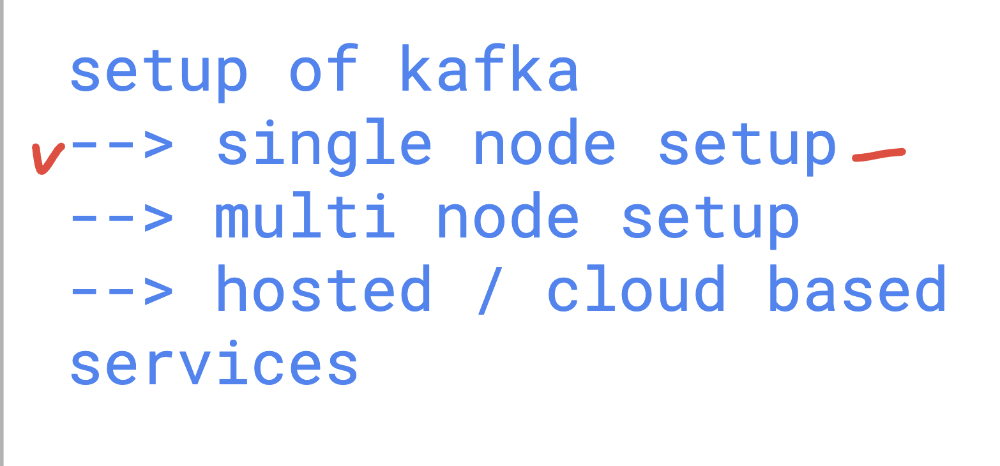
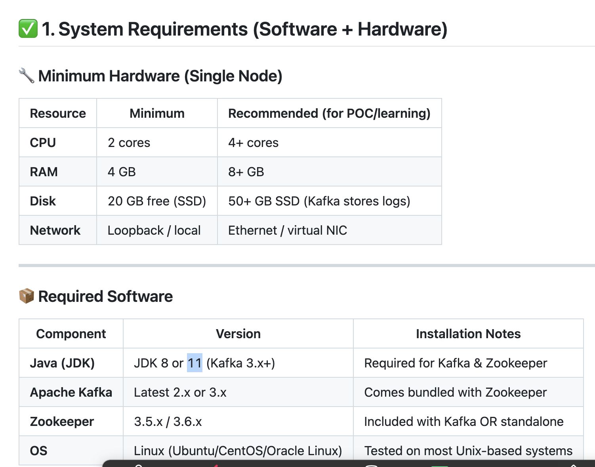
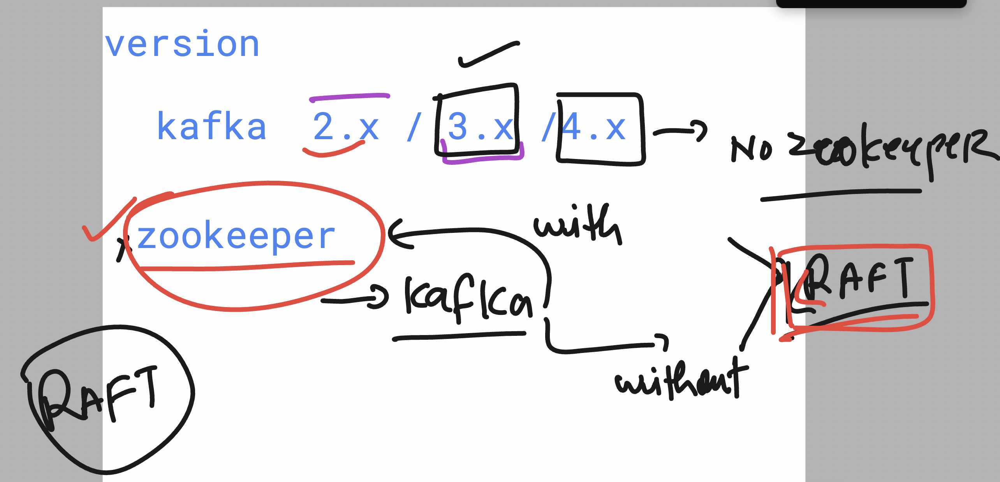
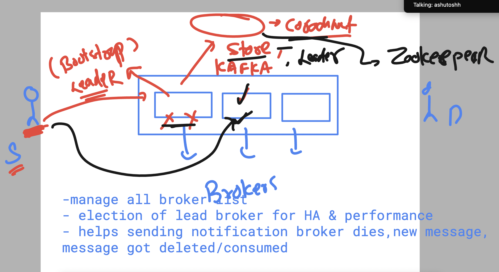
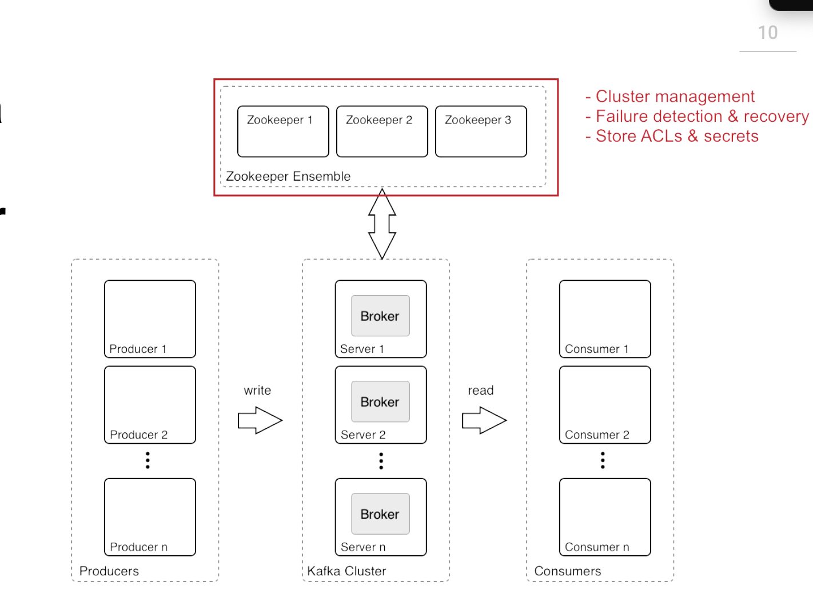

# Oracle_Kafka30thJune2025

### Understanding sending data from sources to target -- problem 




### Introduction to distributed messaging and event store platform 



## few more info about apache kafka



### kafka setup for vertical vs horizontal scaling 




### Kafka components and names



### setup kafka options 



# setup apache kafka on any linux based platform

### Prerequisite 




### basic details to check 

```
[opc@instance-20250630-0613 ~]$ uname -r
5.15.0-309.180.4.el8uek.x86_64

[opc@instance-20250630-0613 ~]$ cat  /etc/os-release 
NAME="Oracle Linux Server"
VERSION="8.10"
ID="ol"
ID_LIKE="fedora"
VARIANT="Server"
VARIANT_ID="server"
VERSION_ID="8.10"

```

## setup Java 11 with devel support 

### Installation of jdk 11

```

```

### verify and set java_home env variable 

```
ec2-user@ip-172-31-40-73 ~]$ java -version 
openjdk version "11.0.27" 2025-04-15 LTS

OpenJDK Runtime Environment Corretto-11.0.27.6.1 (build 11.0.27+6-LTS)
OpenJDK 64-Bit Server VM Corretto-11.0.27.6.1 (build 11.0.27+6-LTS, mixed mode)

[ec2-user@ip-172-31-40-73 ~]$ jps
27534 Jps

===> setting ENV 
readlink  -f $(which java)

/usr/lib/jvm/java-11-amazon-corretto.x86_64/bin/java

===> in .bashrc file 
JAVA_HOME=/usr/lib/jvm/java-11-amazon-corretto.x86_64
PATH=$PATH:$JAVA_HOME/bin
export PATH

===>
source ~/.bashrc 

==
echo $JAVA_HOME
/usr/lib/jvm/java-11-amazon-corretto.x86_64

java -version 
jps

```

## kafka version understanding 



### few basic points to understand in kafka about zookeeper



### zookeeper with kafka  




## setup 

### Download kafka 3.9 with scala 2.3 support binary 

```
wget  https://dlcdn.apache.org/kafka/3.9.1/kafka_2.13-3.9.1.tgz

[ec2-user@ip-172-31-40-73 ~]$ ls
kafka_2.13-3.9.1.tgz

[ec2-user@ip-172-31-40-73 ~]$ tar  xvf  kafka_2.13-3.9.1.tgz 
kafka_2.13-3.9.1/
kafka_2.13-3.9.1/LICENSE
kafka_2.13-3.9.1/NOTICE

===>
[ec2-user@ip-172-31-40-73 ~]$ ls  kafka_2.13-3.9.1
LICENSE  NOTICE  bin  config  libs  licenses  site-docs
[ec2-user@ip-172-31-40-73 ~]$ 
[ec2-user@ip-172-31-40-73 ~]$ ls  kafka_2.13-3.9.1/config/
connect-console-sink.properties    connect-file-source.properties   consumer.properties  server.properties
connect-console-source.properties  connect-log4j.properties         kraft                tools-log4j.properties
connect-distributed.properties     connect-mirror-maker.properties  log4j.properties     trogdor.conf
connect-file-sink.properties       connect-standalone.properties    producer.properties  zookeeper.properties
[ec2-user@ip-172-31-40-73 ~]$ 
[ec2-user@ip-172-31-40-73 ~]$ ls  kafka_2.13-3.9.1/bin/
connect-distributed.sh        kafka-consumer-groups.sh     kafka-metadata-quorum.sh            kafka-topics.sh
connect-mirror-maker.sh       kafka-consumer-perf-test.sh  kafka-metadata-shell.sh             kafka-transactions.sh
connect-plugin-path.sh        kafka-delegation-tokens.sh   kafka-mirror-maker.sh               kafka-verifiable-consumer.sh
connect-standalone.sh         kafka-delete-records.sh      kafka-producer-perf-test.sh         kafka-verifiable-producer.sh
kafka-acls.sh                 kafka-dump-log.sh            kafka-reassign-partitions.sh        trogdor.sh
kafka-broker-api-versions.sh  kafka-e2e-latency.sh         kafka-replica-verification.sh       windows

```

### setting kafka_home variable 

```
[ec2-user@ip-172-31-40-73 ~]$ tail -7  ~/.bashrc 
fi

unset rc
JAVA_HOME=/usr/lib/jvm/java-11-amazon-corretto.x86_64
KAFKA_HOME=/home/ec2-user/kafka_2.13-3.9.1
PATH=$PATH:$JAVA_HOME/bin:$KAFKA_HOME/bin
export PATH


[ec2-user@ip-172-31-40-73 ~]$ 
[ec2-user@ip-172-31-40-73 ~]$ source ~/.bashrc 
[ec2-user@ip-172-31-40-73 ~]$ 


[ec2-user@ip-172-31-40-73 ~]$ kafka-
kafka-acls.sh                       kafka-dump-log.sh                   kafka-reassign-partitions.sh
kafka-broker-api-versions.sh        kafka-e2e-latency.sh                kafka-replica-verification.sh
kafka-client-metrics.sh             kafka-features.sh                   kafka-run-class.sh
kafka-cluster.sh                    kafka-get-offsets.s

```

### starting zookeeper server 

```
zookeeper-server-start.sh  -daemon  /home/ec2-user/kafka_2.13-3.9.1/config/zookeeper.properties 

[ec2-user@ip-172-31-40-73 ~]$ 
[ec2-user@ip-172-31-40-73 ~]$ netstat -nlpt
(Not all processes could be identified, non-owned process info
 will not be shown, you would have to be root to see it all.)
Active Internet connections (only servers)
Proto Recv-Q Send-Q Local Address           Foreign Address         State       PID/Program name    
tcp        0      0 0.0.0.0:22              0.0.0.0:*               LISTEN      -                   
tcp6       0      0 :::2181                 :::*                    LISTEN      31484/java          
tcp6       0      0 :::22                   :::*                    LISTEN      -                   
tcp6       0      0 :::37265                :::*                    LISTEN      31484/java          
[ec2-user@ip-172-31-40-73 ~]$ 


```

### start apache kafka server 

```
[ec2-user@ip-172-31-40-73 ~]$ kafka-server-start.sh  -daemon /home/ec2-user/kafka_2.13-3.9.1/config/server.properties 
[ec2-user@ip-172-31-40-73 ~]$ 
[ec2-user@ip-172-31-40-73 ~]$ 
[ec2-user@ip-172-31-40-73 ~]$ 
[ec2-user@ip-172-31-40-73 ~]$ jps
31970 QuorumPeerMain
32777 Jps
32701 Kafka


[ec2-user@ip-172-31-40-73 ~]$ netstat -nlpt
(Not all processes could be identified, non-owned process info
 will not be shown, you would have to be root to see it all.)
Active Internet connections (only servers)
Proto Recv-Q Send-Q Local Address           Foreign Address         State       PID/Program name    
tcp        0      0 0.0.0.0:22              0.0.0.0:*               LISTEN      -                   
tcp6       0      0 :::34985                :::*                    LISTEN      32701/java          
tcp6       0      0 :::2181                 :::*                    LISTEN      31970/java          
tcp6       0      0 :::32963                :::*                    LISTEN      31970/java          
tcp6       0      0 :::22                   :::*                    LISTEN      -                   
tcp6       0      0 :::9092                 :::*                    LISTEN      32701/java          
[ec2-user@ip-172-31-40-73 ~]$ 


```
