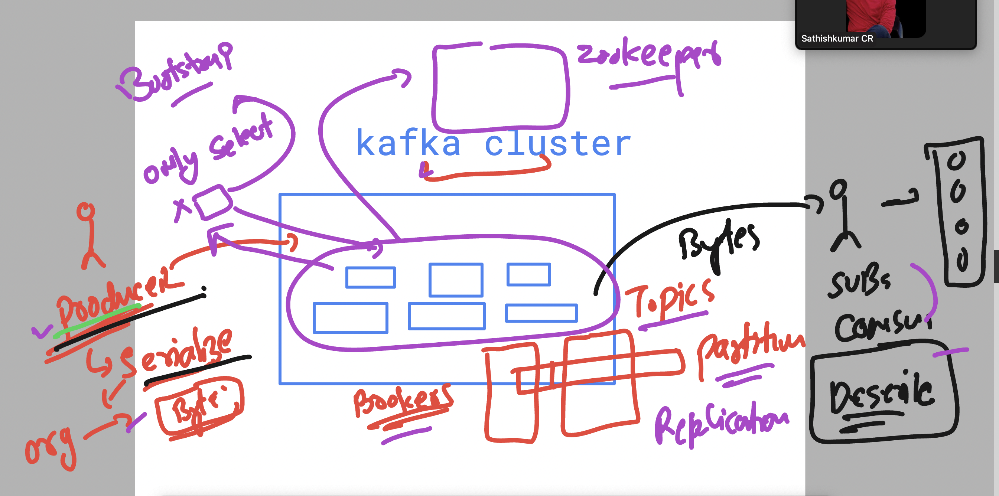
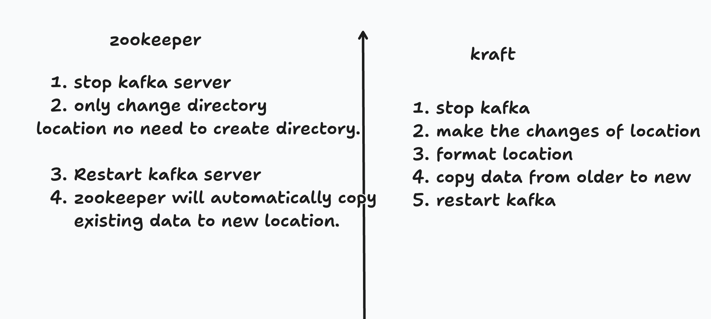

# Oracle_Kafka30thJune2025

### revision  



### verify and started kafka lab environment 

```
[ec2-user@ip-172-31-40-73 ~]$ ls
kafka_2.13-3.9.1  kafka_2.13-3.9.1.tgz
[ec2-user@ip-172-31-40-73 ~]$ echo $JAVA_HOME
/usr/lib/jvm/java-11-amazon-corretto.x86_64
[ec2-user@ip-172-31-40-73 ~]$ echo $KAFKA_HOME
/home/ec2-user/kafka_2.13-3.9.1
[ec2-user@ip-172-31-40-73 ~]$ jps
2330 Jps
[ec2-user@ip-172-31-40-73 ~]$ zookeeper-server-start.sh  -daemon  /home/ec2-user/kafka_2.13-3.9.1/config/zookeeper.properties 
[ec2-user@ip-172-31-40-73 ~]$ jps
2834 Jps
2806 QuorumPeerMain
[ec2-user@ip-172-31-40-73 ~]$ netstat -nlpt
(Not all processes could be identified, non-owned process info
 will not be shown, you would have to be root to see it all.)
Active Internet connections (only servers)
Proto Recv-Q Send-Q Local Address           Foreign Address         State       PID/Program name    
tcp        0      0 0.0.0.0:22              0.0.0.0:*               LISTEN      -                   
tcp6       0      0 :::36813                :::*                    LISTEN      2806/java           
tcp6       0      0 :::22                   :::*                    LISTEN      -                   
tcp6       0      0 :::2181                 :::*                    LISTEN      2806/java           
[ec2-user@ip-172-31-40-73 ~]$ kafka-server-start.sh  -daemon  /home/ec2-user/kafka_2.13-3.9.1/config/server.properties 
[ec2-user@ip-172-31-40-73 ~]$ jps
3253 Kafka
2806 QuorumPeerMain
3293 Jps
[ec2-user@ip-172-31-40-73 ~]$ netstat -nlpt
(Not all processes could be identified, non-owned process info
 will not be shown, you would have to be root to see it all.)
Active Internet connections (only servers)
Proto Recv-Q Send-Q Local Address           Foreign Address         State       PID/Program name    
tcp        0      0 0.0.0.0:22              0.0.0.0:*               LISTEN      -                   
tcp6       0      0 :::46511                :::*                    LISTEN      3253/java           
tcp6       0      0 :::36813                :::*                    LISTEN      2806/java           
tcp6       0      0 :::22                   :::*                    LISTEN      -                   
tcp6       0      0 :::2181                 :::*                    LISTEN      2806/java           
tcp6       0      0 :::9092                 :::*                    LISTEN      3253/java           

```

### connecting to remote zookeeper and kafka 

```
echo dump | nc 54.179.159.70  2181 
[ec2-user@ip-172-31-40-73 ~]$ kafka-topics.sh  --bootstrap-server  54.179.159.70:9092  --list 

[ec2-user@ip-172-31-40-73 ~]$ kafka-topics.sh  --bootstrap-server  54.179.159.70:9092  --create --topic ashu-topic1  
Created topic ashu-topic1.
[ec2-user@ip-172-31-40-73 ~]$ kafka-topics.sh  --bootstrap-server  54.179.159.70:9092  --list 
ashu-topic1
[ec2-user@ip-172-31-40-73 ~]$ 

```

## for storing data persistently even after reboot/stop in kafka

###  steps 

```
kafka-server-stop.sh

===>
 vim server.properties  +62
# replace of rewrite this line 
 log.dirs=/home/ec2-user/ashu-kafka

 ===>
 kafka-server-start.sh  -daemon /home/ec2-user/kafka_2.13-3.9.1/config/server.properties 

```

### difference 



### few more commands 


```
[ec2-user@ip-172-31-40-73 ~]$  kafka-topics.sh  --bootstrap-server  localhost:9092  --create --topic ashu-topic2
Created topic ashu-topic2.
[ec2-user@ip-172-31-40-73 ~]$ 
[ec2-user@ip-172-31-40-73 ~]$ kafka-topics.sh  --bootstrap-server  localhost:9092  --list 
ashu-topic1
ashu-topic2
[ec2-user@ip-172-31-40-73 ~]$ ls /tmp/kafka-logs/
ashu-topic1-0  cleaner-offset-checkpoint  log-start-offset-checkpoint  meta.properties  recovery-point-offset-checkpoint  replication-offset-checkpoint
[ec2-user@ip-172-31-40-73 ~]$ 
[ec2-user@ip-172-31-40-73 ~]$ 
[ec2-user@ip-172-31-40-73 ~]$ ls /home/ec2-user/ashu-kafka/
ashu-topic1-0  cleaner-offset-checkpoint    meta.properties                   replication-offset-checkpoint
ashu-topic2-0  log-start-offset-checkpoint  recovery-point-offset-checkpoint
[ec2-user@ip-172-31-40-73 ~]$ 

```

### using producer to send data to kafka topic 

```
 kafka-console-producer.sh  --bootstrap-server 3.1.143.30:9092  --topic  ashu-topic1
```

### using kafka_dump tool we can check internal storage data location 


```
c2-user@ip-172-31-40-73 ashu-kafka]$ pwd
/home/ec2-user/ashu-kafka

[ec2-user@ip-172-31-40-73 ashu-kafka]$ ls
Deepali-0              __consumer_offsets-20  __consumer_offsets-34  __consumer_offsets-48    bala-new-2-web-events-0      man-new-topic-0
Nalini-topic-0         __consumer_offsets-21  __consumer_offsets-35  __consumer_offsets-49    bala-new-web-events-0        meta.properties
__consumer_offsets-0   __consumer_offsets-22  __consumer_offsets-36  __consumer_offsets-5     baskar-msg-0                 muny_new_topic-0
__consumer_offsets-1   __consumer_offsets-23  __consumer_offsets-37  __consumer_offsets-6     baskar-topic1-0              recovery-point-offset-checkpoint
__consumer_offsets-10  __consumer_offsets-24  __consumer_offsets-38  __consumer_offsets-7     cleaner-offset-checkpoint    replication-offset-checkpoint
__consumer_offsets-11  __consumer_offsets-25  __consumer_offsets-39  __consumer_offsets-8     crsk-topic-d2-0              sathyap-web-events-0
__consumer_offsets-12  __consumer_offsets-26  __consumer_offsets-4   __consumer_offsets-9     crsk-topic2-d2-0             shivanshuashu-web-events-0
__consumer_offsets-13  __consumer_offsets-27  __consumer_offsets-40  ak-topic-0               dash-Topic001-0              shree-web-events-0
__consumer_offsets-14  __consumer_offsets-28  __consumer_offsets-41  ani1-0                   day2-0                       suchi-topic-new-0
__consumer_offsets-15  __consumer_offsets-29  __consumer_offsets-42  ani2-0                   day21-0                      suchi_topic_new-0
__consumer_offsets-16  __consumer_offsets-3   __consumer_offsets-43  arpit-new-topic-0        day22-0                      suneel_topic-0
__consumer_offsets-17  __consumer_offsets-30  __consumer_offsets-44  ashu-new-topic-0         komp007-0
__consumer_offsets-18  __consumer_offsets-31  __consumer_offsets-45  ashu-topic1-0            komp111-0
__consumer_offsets-19  __consumer_offsets-32  __consumer_offsets-46  ashu-topic2-0            komp420-0
__consumer_offsets-2   __consumer_offsets-33  __consumer_offsets-47  bala-new-1-web-events-0  log-start-offset-checkpoint
[ec2-user@ip-172-31-40-73 ashu-kafka]$ cd ashu-topic1-0/

[ec2-user@ip-172-31-40-73 ashu-topic1-0]$ ls
00000000000000000000.index  00000000000000000000.log  00000000000000000000.timeindex  leader-epoch-checkpoint  partition.metadata
[ec2-user@ip-172-31-40-73 ashu-topic1-0]$ kafka-dump-log.sh  --print-data-log  --files  /home/ec2-user/ashu-kafka/ashu-topic1-0/00000000000000000000.log 

```

### Kafka consumer 

```
 kafka-console-consumer.sh  --bootstrap-server 3.1.143.30:9092  --topic  ashu-topic1 --from-beginning

```
