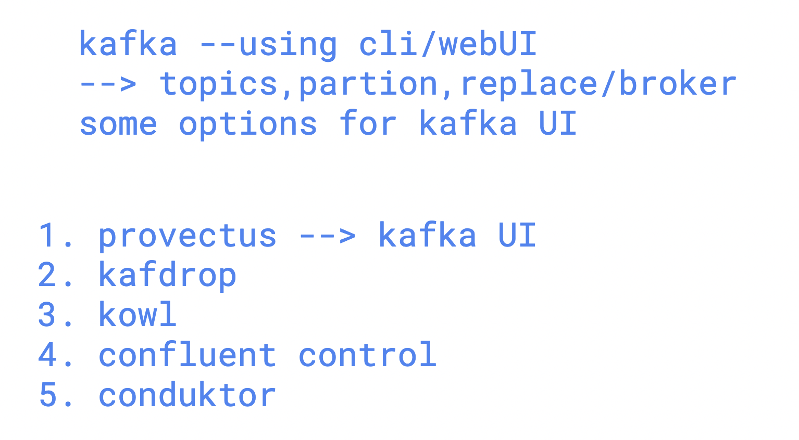
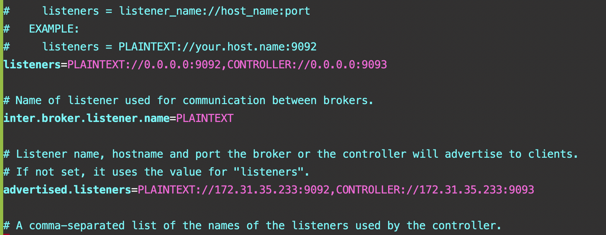

### Revision 


### Kafka Dataflow


### Kafka Producer Details


### Kafka Topics


### More on Topics


## Kafka Multi Node Cluster Understanding


### Kafka Multi Node Cluster Setup Understanding


## As Kafka Client – Connecting to broker1

```sh
kafka-topics.sh --bootstrap-server 3.1.143.30:9092 --list

kafka-topics.sh --bootstrap-server 3.1.143.30:9092 --create --topic oracle-data1 --partitions 3 --replication-factor 2
Created topic oracle-data1.
[ec2-user@broker1 ~]$
[ec2-user@broker1 ~]$
[ec2-user@broker1 ~]$ kafka-topics.sh --bootstrap-server 3.1.143.30:9092 --list
oracle-data1
poc-topic1
topic2
[ec2-user@broker1 ~]$ kafka-topics.sh --bootstrap-server 3.1.143.30:9092 --describe --topic oracle-data1
Topic: oracle-data1	TopicId: u3lZmULPRB2AmRq6nIJUUQ	PartitionCount: 3	ReplicationFactor: 2	Configs: segment.bytes=1073741824
    Topic: oracle-data1	Partition: 0	Leader: 1	Replicas: 1,2	Isr: 1,2	Elr: 	LastKnownElr:
    Topic: oracle-data1	Partition: 1	Leader: 2	Replicas: 2,3	Isr: 2,3	Elr: 	LastKnownElr:
    Topic: oracle-data1	Partition: 2	Leader: 3	Replicas: 3,1	Isr: 3,1	Elr: 	LastKnownElr:
[ec2-user@broker1 ~]$
```

### Creating Custom Environment in Kafka Client Machine

```sh
[oracle@ip-172-31-35-233 ~]$ mkdir ashu

[oracle@ip-172-31-35-233 ~]$ ls
ashu  kafka_2.13-3.9.1  kafka_2.13-3.9.1.tgz  py_env

[oracle@ip-172-31-35-233 ~]$ cd ashu/

[oracle@ip-172-31-35-233 ashu]$ python3 -m venv ashu-client
[oracle@ip-172-31-35-233 ashu]$
[oracle@ip-172-31-35-233 ashu]$ source ashu-client/bin/activate
(ashu-client) [oracle@ip-172-31-35-233 ashu]$
(ashu-client) [oracle@ip-172-31-35-233 ashu]$ pip install kafka-python confluent_kafka
Collecting kafka-python
  Downloading kafka_python-2.2.15-py2.py3-none-any.whl (309 kB)
     |████████████████████████████████| 309 kB 15.5 MB/s
Collecting confluent_kafka
  Downloading confluent_kafka-2.10.1-cp39-cp39-manylinux_2_28_x86_64.whl (3.9 MB)
     |████████████████████████████████| 3.9 MB 26.8 MB/s
Installing collected packages: kafka-python, confluent-kafka
Successfully installed confluent-kafka-2.10.1 kafka-python-2.2.15
WARNING: You are using pip version 21.3.1; however, version 25.1.1 is available.
You should consider upgrading via the '/home/oracle/ashu/ashu-client/bin/python3 -m pip install --upgrade pip' command.
(ashu-client) [oracle@ip-172-31-35-233 ashu]$
```

### Kafka UI Options



## Installing podman-compose in OCLI

```sh
pip3 install --user podman-compose
echo 'export PATH=$HOME/.local/bin:$PATH' >> ~/.bashrc
source ~/.bashrc
podman-compose -f kafka-ui.yaml up -d

# Once it's done, verify running Kafka UI container
podman-compose -f kafka-ui.yaml ps

# Allow in OCI firewall
# Allow/disable OCI VM firewalld
sudo systemctl stop firewalld
sudo systemctl disable firewalld
```

### Podman Run Without Compose

```sh
podman run -itd -p 8080:8080 \
  -e KAFKA_CLUSTERS_0_NAME=ashu-kafka-cluster \
  -e KAFKA_CLUSTERS_0_BOOTSTRAPSERVERS=172.31.35.233:9092 \
  docker.io/provectuslabs/kafka-ui:latest

# Check running containers
podman ps
```

### Podman-Compose with Python Version Problem

#### Solution

Upgrade to Python 3.8 or newer. Here's how on Oracle Linux:

```sh
sudo yum install -y python38
python3.8 --version  # Should say Python 3.8.x

# Then reinstall podman-compose using the new Python:
python3.8 -m pip install --user podman-compose

# Run it like this:
~/.local/bin/podman-compose -f kafka-ui.yaml up -d

# Or create an alias:
alias podman-compose='~/.local/bin/podman-compose'
```

## Some troubleshooting 

```
 332  rm -rf /tmp/kraft-combined-logs/
  333  history 
  334  kafka-server-stop.sh 
  335  history 
  336  kafka-storage.sh  format -t MBN-9lzMQoSaaZLt3waDww  -c  /home/oracle/kafka_2.13-3.9.1/config/kraft/server.properties 
  337  history 
  338  kafka-server-start.sh -daemon  /home/oracle/kafka_2.13-3.9.1/config/kraft/server.properties
  339  jps

```

### kafka kraft changes



