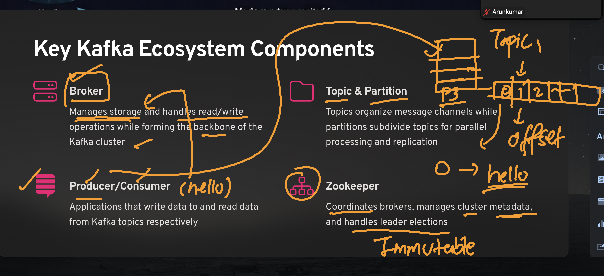

### Revision 



### Kafka dataflow 


### kafka producer details 


### kafka topics 


### more on topics 


## Kafka multi node cluster understanding 


### kafka multi node cluster setup understadning


## as kafka client --connecting to broker1

```
kafka-topics.sh  --bootstrap-server 3.1.143.30:9092 --list

kafka-topics.sh  --bootstrap-server 3.1.143.30:9092 --create --topic   oracle-data1  --partitions 3 --replication-factor  2
Created topic oracle-data1.
[ec2-user@broker1 ~]$ 
[ec2-user@broker1 ~]$ 
[ec2-user@broker1 ~]$ kafka-topics.sh  --bootstrap-server 3.1.143.30:9092 --list
oracle-data1
poc-topic1
topic2
[ec2-user@broker1 ~]$ kafka-topics.sh  --bootstrap-server 3.1.143.30:9092 --describe --topic oracle-data1 
Topic: oracle-data1	TopicId: u3lZmULPRB2AmRq6nIJUUQ	PartitionCount: 3	ReplicationFactor: 2	Configs: segment.bytes=1073741824
	Topic: oracle-data1	Partition: 0	Leader: 1	Replicas: 1,2	Isr: 1,2	Elr: 	LastKnownElr: 
	Topic: oracle-data1	Partition: 1	Leader: 2	Replicas: 2,3	Isr: 2,3	Elr: 	LastKnownElr: 
	Topic: oracle-data1	Partition: 2	Leader: 3	Replicas: 3,1	Isr: 3,1	Elr: 	LastKnownElr: 
[ec2-user@broker1 ~]$ 


```

### creating custom env in kafka-client machine 

```
oracle@ip-172-31-35-233 ~]$ mkdir  ashu

[oracle@ip-172-31-35-233 ~]$ ls
ashu  kafka_2.13-3.9.1  kafka_2.13-3.9.1.tgz  py_env

[oracle@ip-172-31-35-233 ~]$ cd ashu/

[oracle@ip-172-31-35-233 ashu]$ python3 -m venv   ashu-client 
[oracle@ip-172-31-35-233 ashu]$ 
[oracle@ip-172-31-35-233 ashu]$ source ashu-client/bin/activate
(ashu-client) [oracle@ip-172-31-35-233 ashu]$ 
(ashu-client) [oracle@ip-172-31-35-233 ashu]$ pip install kafka-python confluent_kafka 
Collecting kafka-python
  Downloading kafka_python-2.2.15-py2.py3-none-any.whl (309 kB)
     |████████████████████████████████| 309 kB 15.5 MB/s            
Collecting confluent_kafka
  Downloading confluent_kafka-2.10.1-cp39-cp39-manylinux_2_28_x86_64.whl (3.9 MB)
     |████████████████████████████████| 3.9 MB 26.8 MB/s            
Installing collected packages: kafka-python, confluent-kafka
Successfully installed confluent-kafka-2.10.1 kafka-python-2.2.15
WARNING: You are using pip version 21.3.1; however, version 25.1.1 is available.
You should consider upgrading via the '/home/oracle/ashu/ashu-client/bin/python3 -m pip install --upgrade pip' command.
(ashu-client) [oracle@ip-172-31-35-233 ashu]$ 

```

