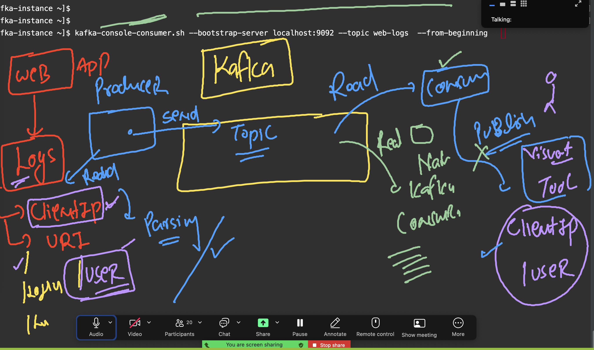
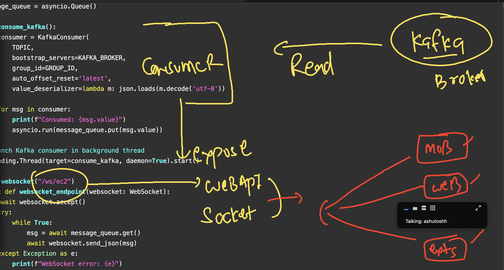

# revision 

### Producer and consumer groups info 


### kafka cluster architecture 


### Installing httpd sample webapp 

```
sudo dnf install httpd -y 

pc@kafka-instance ~]$ 
[opc@kafka-instance ~]$ cd  /var/www/html/
[opc@kafka-instance html]$ ls
[opc@kafka-instance html]$ echo "hello world from OCI vm" >index.html 
-bash: index.html: Permission denied
[opc@kafka-instance html]$ sudo -s
[root@kafka-instance html]# 
[root@kafka-instance html]# echo "hello world from OCI vm" >index.html
[root@kafka-instance html]# ls
index.html
[root@kafka-instance html]# mkdir user
[root@kafka-instance html]# echo "hello from user URL" >user/index.html
[root@kafka-instance html]# 

 12  systemctl start httpd
   13  systemctl status httpd
   14  curl ifconfig.me 
   15  curl localhost
   16  curl localhost/user
   17  cd /var/log/httpd/
   18  ls


curl localhost/user
   17  cd /var/log/httpd/
   18  ls
   19  cat access_log 
```

### Creating topic to send logs 

```
opc@kafka-instance ~]$ kafka-topics.sh  --bootstrap-server localhost:9092 --list
demo_topic
demotopic
[opc@kafka-instance ~]$ kafka-topics.sh  --bootstrap-server localhost:9092 --create --topic  web-logs
Created topic web-logs.
[opc@kafka-instance ~]$ kafka-topics.sh  --bootstrap-server localhost:9092 --list
demo_topic
demotopic
web-logs

```

## to send logs to kafka topic

```
python3  finalproducer.py

```

### in second terminal 

```
kafka-console-consumer.sh --bootstrap-server localhost:9092 --topic web-logs  --from-beginning 
```

### summary of small project i have created 




### creating python consumer with flask webapp ui to show consumed messages

```
pip3 install flask 
python3 deploy.py 
# it will deploy consumer + webapp (ip:5000)
```

## From kafka client machine checking connection to kafka-cluster 

```
 kafka-topics.sh  --bootstrap-server  172.31.40.73:9092 --list
__consumer_offsets
ashu-python-topic1
ashu-topic1
ashu-ui-topic
bakshu-python-topic6
mj-python-topic1
mj-python-topic111

===>
 kafka-topics.sh  --bootstrap-server  172.31.40.73:9092 --create --topic anitha-aws-oci-event --partitions 3 --replication-factor 2

```

### checking with existing env 

```
oracle@ip-172-31-35-233 ~]$ ls
Bakshu     anitha  arun  bala  dash              kafka_2.13-3.9.1.tgz  munyatam  py_env  suchi
Shivanshu  arpit   ashu  crsk  kafka_2.13-3.9.1  man                   nalini    sathya
[oracle@ip-172-31-35-233 ~]$ cd ashu/
[oracle@ip-172-31-35-233 ashu]$ ls
ashu-client  kafka-client.py  kafka-ui.yaml
[oracle@ip-172-31-35-233 ashu]$ ls ashu-client/
bin  include  lib  lib64  pyvenv.cfg
[oracle@ip-172-31-35-233 ashu]$ 
[oracle@ip-172-31-35-233 ashu]$ python3 -m venv  ashu-client ^C
[oracle@ip-172-31-35-233 ashu]$ ls
ashu-client  kafka-client.py  kafka-ui.yaml
[oracle@ip-172-31-35-233 ashu]$ source ashu-client/bin/activate
(ashu-client) [oracle@ip-172-31-35-233 ashu]$ pip install boto3 oci kafka-python 


```

### Consumer read and webapi expose understandig 



### consumer python module installed 

```

pip install fastapi websockets uvicorn 
uvicorn  aws-consumer:app  --host 0.0.0.0 --port 8081

#note here aws-consumer is the name of python file 
```

### running webapp 
: change portnumber in script.js  (whatever you are using in uvicorn)
### running app
```
cd ashu-webapp
python3 -m http.server 9001  # change port 9000-10000
```