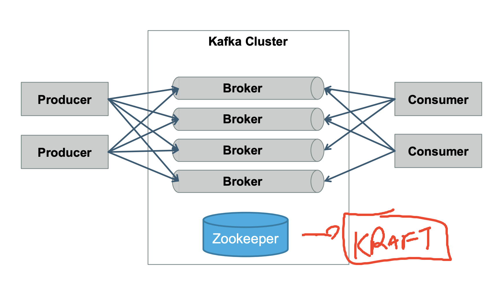

# revision 

### Producer and consumer groups info 


### kafka cluster architecture 




### Installing httpd sample webapp 

```
sudo dnf install httpd -y 

pc@kafka-instance ~]$ 
[opc@kafka-instance ~]$ cd  /var/www/html/
[opc@kafka-instance html]$ ls
[opc@kafka-instance html]$ echo "hello world from OCI vm" >index.html 
-bash: index.html: Permission denied
[opc@kafka-instance html]$ sudo -s
[root@kafka-instance html]# 
[root@kafka-instance html]# echo "hello world from OCI vm" >index.html
[root@kafka-instance html]# ls
index.html
[root@kafka-instance html]# mkdir user
[root@kafka-instance html]# echo "hello from user URL" >user/index.html
[root@kafka-instance html]# 

 12  systemctl start httpd
   13  systemctl status httpd
   14  curl ifconfig.me 
   15  curl localhost
   16  curl localhost/user
   17  cd /var/log/httpd/
   18  ls


curl localhost/user
   17  cd /var/log/httpd/
   18  ls
   19  cat access_log 
```
